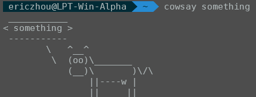
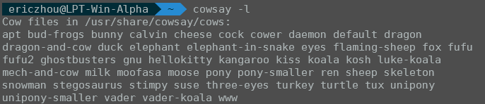
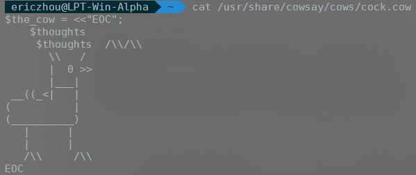
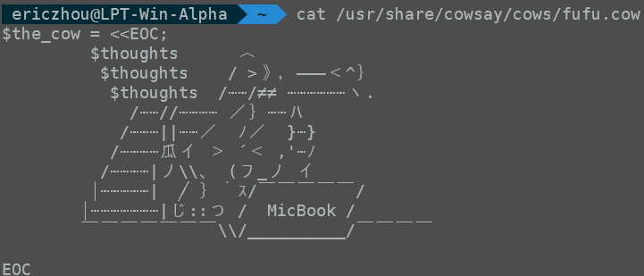
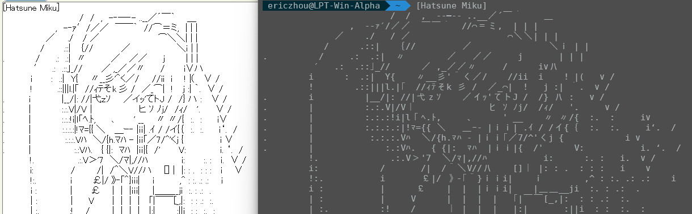
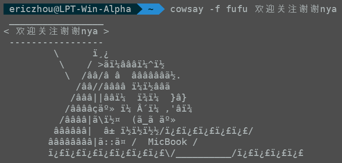
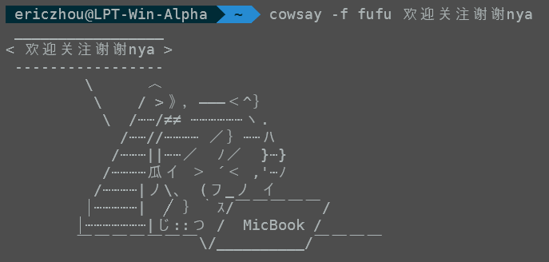
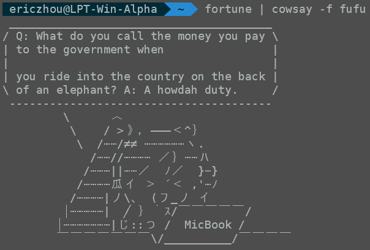

# cowsay

Author: 3BM42-完熟芒果

Today, we are going to teach you how to use `cowsay` to create custom ASCII art and add our beloved fufu to your terminal.

## What is `cowsay` anyway?

According to Wikipedia and `man cowsay`, [cowsay](https://en.wikipedia.org/wiki/Cowsay#:~:text=cowsay%20is%20a%20program%20that,It%20is%20written%20in%20Perl.) [1] generates an ASCII picture of a cow saying something provided by the user, it is one of the ASCII art (AA in short) generator among all the ASCII art generator programs (others like `aa-fire`, `cmatrix`, `sl`, etc.). A regular `cowsay` output look like this.

Just like what its name implies, a cow saying something that you give it as an argument is printed to your terminal.

I am using Ubuntu as my running environment, installation of `cowsay` includes invoking a single `apt-get` command as follows.

    sudo apt-get install cowsay -y
  
If you are using other Linux distributions, use your package manager like `yum` or `brew` accordingly.

## What is cowfile and how to create your own cowfile?

cowfile is used by `cowsay` as an base of ASCII art, it is used by the perl script as the input to the . No more plain talking, Let's take a look at the existing cowfiles that comes with the program to see how it is structured. The location of all cowfiles and all the cowfiles you have right now can be viewed using the command

    cowsay -l

And the commandline output should be something similar to this

As you can easily see, all the cowfiles are stored in the location `/usr/share/cowsay/cows/` folder, and if we open one of them for inspection, the cowfile content look like this:

Here you can find the variable that need to be set in order for cowsay to run: `$the_cow`. Anything that you assigned to the variable will be used as the base of the ASCII art that displayed to your terminal when invoked. The other variables are set optionally, for example `$thought`, `$eyes`, and `$tongue`. Together with other command line arguments such as `-b`, `-d`, `-g`, `-s`, `-t`, `-w`, `-y`, `-e <eye_string>`, and `-T <tongue_string>`, you can customize your cowfile to allow more interaction with the command line. But due to my laziness, I will not cover them fully cover them, visit its man page and RTDC instead. 

The other essential part of the file is the `<<"EOC"` and the `EOC` at the end of the file. You can already guess its usage, serve as a multiline string assignment and end-of-capturing signal. This have a similar usage as its bash counterpart, `cat` and `EOF`.

Now you have all the knowledge about how to write a cowfile, lets customize one for our beloved fufu! Create a cowfile (you can either include or exclude the `.cow` extension. Don't worry, `cowsay` will find it correctly) in the same directory as other cowfiles with your favorite editor and paste the ASCII art you have, for example

    sudo vim /usr/share/cowsay/cows/fufu.cow
    (Then paste with whatever method you like, save and exit)

Thanks to Pen_Coop provide the fufu ASCII art, we now have a cowfile with our own ASCII art! Next step is to invoke `cowsay` with our own cowfile! Use the following command to achieve this:

    cowsay -f fufu <the string you would like fufu to say>

Remember, the text displayed by terminal is often some [monospaced font](https://en.wikipedia.org/wiki/Monospaced_font) [2], opposed to regular text in proportional font. This indicates that all the characters have equal width (or the characters occupy the same horizontal space in a more technical term), unlike the texts that you see in regular text editors like Windows Notepad or Microsoft Word. Below is an example of a Miku ASCII Art taken from AAAA website [4] in proportional font (left) and monospaced font (right).

So be aware when you try to create your own ASCII art, the text might look differently when it is viewed in a normal text editor and terminal. So you better take time editing your art in a text editor that supports monospaced font like Visual Studio Code, Notepad++, or just plain Vim.

## Allowing `fufusay` to display UTF-8 characters

Wait! If you test the script before reading this section, you might wonder why your output is not the same as what I produced. You may see something like this:

No! This is not our beloved fufu! This is some random garbage when utf-8 characters are interpreted character by character! If you have the mood to look at and analyze the perl script of `cowsay`, you can use the following command:

    sudo vim $(which cowsay)

I am no good at perl, but after extensive searching and reading the original code, here is what I got. In short, you can see that the characters input to the `cowsay` are properly displayed, while the characters in the cowfile are not. This is because when analyzing the input, the author of `cowsay` add this to the perl script.

    if (${^UTF8LOCALE}) {
        binmode STDIN, ':utf8';
        binmode STDOUT, ':utf8';
        require Encode;
        eval { $_ = Encode::decode_utf8($_,1) } for @ARGV;
    }

If you do not know what this piece of code is about, congratulations! I do not know either. But according to StackOverflow, this piece of code allow perl to treat input and output stream as utf-8 characters, which allow your input string to be correctly displayed.

Then the problem is why the contents in the cowfile are not correctly displayed? According to how the script gets the variable `$the_cow`, which I kind-heartedly pasted below

    sub get_cow {
    ##
    ## Get a cow from the specified cowfile; otherwise use the default cow
    ## which was defined above in $the_cow.
    ##
        my $f = $opts{'f'};
        my $full = "";
        if ($opts{'f'} =~ m,/,) {
            $full = $opts{'f'};
        } else {
            for my $d (split(/:/, $cowpath)) {
                if (-f "$d/$f") {
                    $full = "$d/$f";
                    last;
                } elsif (-f "$d/$f.cow") {
                    $full = "$d/$f.cow";
                    last;
                }
            }
            if ($full eq "") {
                die "$progname: Could not find $f cowfile!\n";
            }
        }
        do $full;
        die "$progname: $@\n" if $@;
    }

On the third last line, the statement `do $full` will execute whatever you supply it with, and the pervious logic have already set the variable `$full` equal to the cowfile you supply it with. Then it will execute the file (yes it will execute the file), and this is how variable `$the_cow` is set. However, the file you supply it with does not know how to interpret the mutiline assignment. Prepend the line in the fufu.cow to allow `$the_cow` variable to take in the correct value.

    using utf8;

Finally, your fufu will look like this:

## Argument fufu with truth of the day

[fortune](https://en.wikipedia.org/wiki/Fortune_(Unix)) [3] is a program that display random massage from a database of quotations. You can supply it to fufu using

    fortune | cowsay -f fufu

Then you can get something like this:

Why it have weird linebreaks? You might realize it very quickly, it is because `fortune` is producing linebreaks for its own pretty print, while `cowsay` also tries to do it, but with a different linewidth. One possible solution here is that you remove the linebreaks added by `cowsay` (as it would be harder for us to remove linebreaks in `fortune`). Luckly, when you look at the manual page, you will find that there is a command line option, `-n`, which stops `cowsay` from trying to create a proper word-warpping on your input message. Here is a picture of how the exact same message is printed after specifying the `-n` option.

    fortune | cowsay -f fufu -n

You can also create an alias to enable us to use `fufusay` instead of `cowsay -f fufu` by using the command

    alias fufusay="cowsay -f fufu"

Add it to the `.bashrc` (or `.zshrc` according to the shell you use) to allow permanent fufu residence in your system! 

## Finally

Now you know what is `cowsay` and how to use it, it is time to argument your terminal with lovely fufu, or any other stuff that you would like to display. For more information about other command line arguments, please consult `man cowsay`, `man` is always your best mate.

## References

[1] Cowsay, Unix program, https://en.wikipedia.org/wiki/Cowsay

[2] Monospaced Font, https://en.wikipedia.org/wiki/Monospaced_font

[3] Fortune, Unix program, https://en.wikipedia.org/wiki/Fortune_(Unix)

[4] AAAA, ASCII art website, http://aa.en.utf8art.com/
